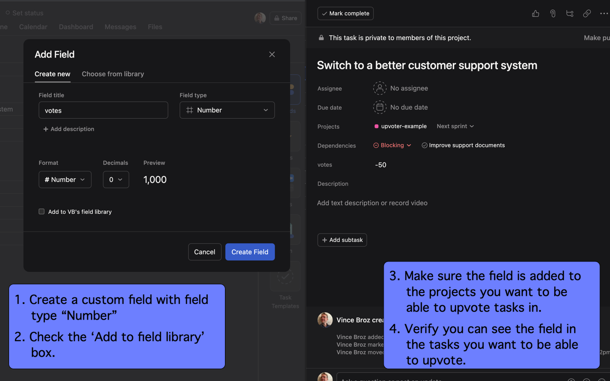
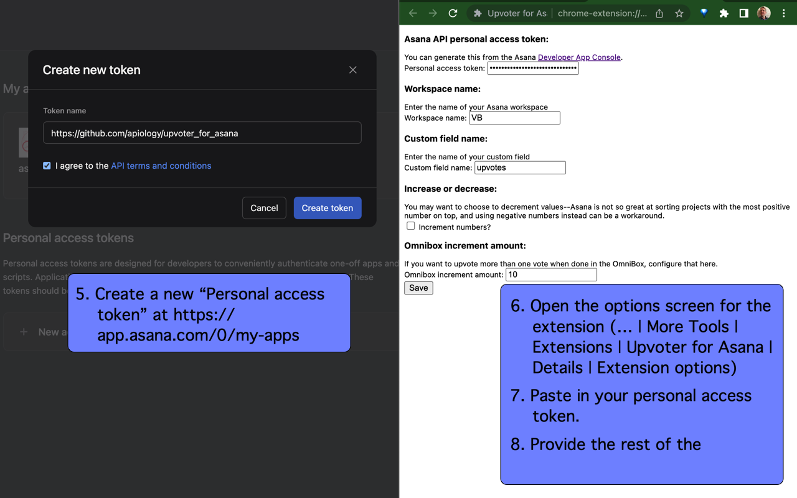

# Upvoter for Asana

Chrome extension which quickly finds and increments integer custom
fields in Asana tasks from the Chrome Omnibox.

This is useful if you're trying to track pain points in a backlog -
just throw a backlog feature task a quick upvote in real time as you
suffer through missing the feature, then go back later and take on the
most upvoted tasks!

## Using Chrome Extension

Go to the URL bar ("Chrome Omnibox"), and type 'uv', a space, then
search for an Asana task.  You should see them pop up as suggestions.
Pick one, and your custom field will be uploaded!

Also, if you mark a task done which has dependent upvotable tasks, you
can click on the dependent task links to upvote those tasks.  See
[Shortcuts for Asana](https://github.com/apiology/shortcuts-for-asana)
for keyboard shortcuts to hit those links!

## Using Alfred Workflow

Similarly, activate Alfred, then type 'uv', a space, then type 'uv', a
space, then search for an Asana task.  You should see them pop up as
suggestions.  Pick one, and your custom field will be uploaded!

## Installing Chrome Extension

## Installing Alfred workflow

The Alfred package isn't published yet - see [DEVELOPMENT.md](./DEVELOPMENT.md) for how to run from a local checkout.

## Chrome Extension Configuration

1. Create a custom field with field type "Number".
2. Check the 'Add to field library' box.
3. Make sure the field is added to the projects you want to be able to
   upvote tasks in.
4. Verify you can see the field in the tasks you want to be able to
   upvote.
5. Create a new "Personal access token" in
   [Asana](https://app.asana.com/0/my-apps)
6. Open the options screen for the extension (… | More Tools |
   Extensions | Upvoter for Asana | Details | Extension options)
7. Paste in your personal access token.
8. Provide the rest of the configuration and hit 'Save'

## Alfred Workflow Configuration

1. Create a new "Personal access token" in
   [Asana](https://app.asana.com/0/my-apps)
1. Alfred | Workflows | Upvoter for Asana | [≈] icon in upper right
1. Add values to Workflow Environment Variables section
1. Save

## Legal

Not created, maintained, reviewed, approved, or endorsed by Asana, Inc.

## Contributions

This project, as with all others, rests on the shoulders of a broad
ecosystem supported by many volunteers doing thankless work, along
with specific contributors.

In particular I'd like to call out:

* [Audrey Roy Greenfeld](https://github.com/audreyfeldroy) for the
  cookiecutter tool and associated examples, which keep my many
  projects building with shared boilerplate with a minimum of fuss.
